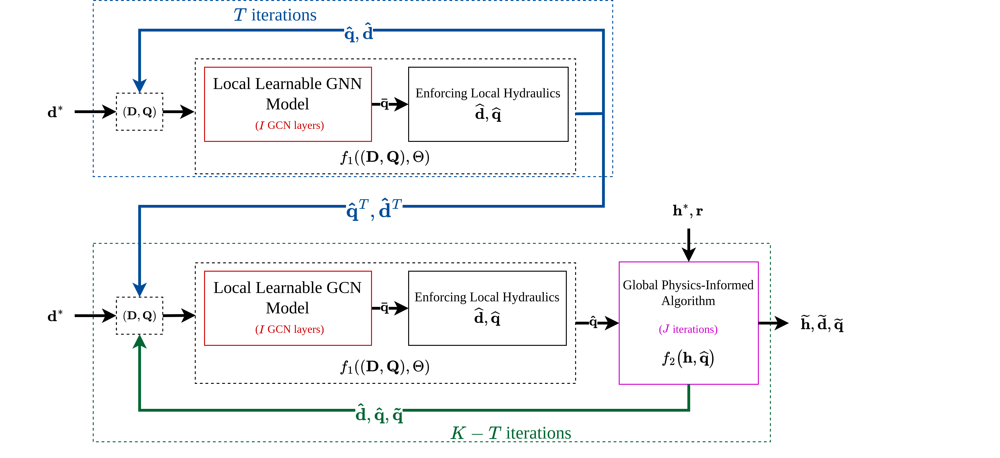

# Scalable and Robust Physics-Informed Graph Neural Networks for Water Distribution Systems.

Official Code for the paper "Scalable and Robust Physics-Informed Graph Neural Networks for Water Distribution Systems" (under submission, preprint available at arXiv: https://arxiv.org/abs/2502.12164). \
All system and package requirements are listed in the document 'environment.yml'. A corresponding conda environment can be setup via `conda env create -f environment.yml`.

## Simulating scenarios to generate data

WDS datasets can be generated (Vrachimis et al. https://github.com/KIOS-Research/BattLeDIM) using: 

``` python
python utils/dataset_generator.py
```

A number of arguments can be passed to dataset generation parameters:

``` python
'--wds'             "Specify the WDS for which you want to simulate the scenarios; default is anytown. Choices are ['anytown', 'hanoi', 'pescara', 'area_c', 'zhijiang', 'modena', 'pa1', 'balerma', 'area_a', 'l_town', 'kl']." 
'--sim_start_time'  "Specify the start time of the simulation; default is 2018-01-01 00:00, the simulation will be done every 30 minutes starting from this time."   
'--sim_end_time'    "Specify the end time of the simulation; default is 2018-01-01 02:30."   
'--start_scenario'  "Specify the start scenario name, must be an integer; default is 1000"
'--end_scenario'    "Specify the end scenario name, must be an integer; default is 1999"
```

The simulation will produce an xlsx file for each scenario in the folder 'results' in the respective directories. These xlsx files will be used for training the models. 

## Training and Evaluation


Models can be trained using  
```python 
python run.py
```
A number of arguments can be passed to specify model types and hyperparameters:

``` python
'--wds'             "Specify the WDS for which you want to simulate the scenarios; default is anytown. Choices are ['anytown', 'hanoi', 'pescara', 'area_c', 'zhijiang', 'modena', 'pa1', 'balerma', 'area_a', 'l_town', 'kl']." 
'--mode'            "train_test i.e. train and test a new model, or evaluate i.e. evaluate on an already trained model; default is train_test. "
'--warm_start'      "Specify True if you want to further train a partially trained model. model_path must also be specified; default is False."
'--model_path'      "Specify model path in case of re-training or evaluation; default is None."
'--model'           "Choose the model between PI_GNN and SPI_GNN; default is SPI_GNN."
'--start_scenario'  "Specify the start scenario name, must be an integer; default is 1"
'--end_scenario'    "Specify the end scenario name, must be an integer; default is 20"
'--n_samples'       "Specify the number of samples for each scenario to be used for training; default is 6."
'--batch_size'      "Specify the mini-batch size; default is 96."
'--n_epochs'        "Specify the number of epochs of training; default is 1500."    
'--lr'              "Specify the learning rate; default is 1e-4."
'--decay_step'      "Specify the step size of the lr scheduler; default is 150."
'--decay_rate'      "Specify the decay rate of the lr scheduler; default is 0.75."
'--I'               "Specify the number of GCN layers; default is 5."
'--n_iter'          "Specify the minimum number of iterations; default is 5."
'--r_iter'          "Specify the maximum number of additional (random) iterations; default is 5."
'--n_mlp'           "Specify the number of layers in the MLP; default is 1."
'--M_l'             "Specify the latent dimension; default is 128."
'--wandb'           "Specify True if you want to use Weights and Biases during training; default is False."

```

Trained models can be used for evaluation using run.py by specifying the 'evaluate' mode and 'model_path'.

## Robustness Evaluation

Trained models can be evaluated for robustness using

```python 
python robustness_eval.py
```
A number of arguments can be passed:

``` python
'--wds'             "Specify the WDS for which you want to simulate the scenarios; default is anytown. Choices are ['anytown', 'hanoi', 'pescara', 'area_c', 'zhijiang', 'modena', 'pa1', 'balerma', 'area_a', 'l_town', 'kl']." 
'--mode'            "'demands' or 'diameters', evaluate robustness by changing demands or diameters; default is demands. "
'--model_path'      "Specify the trained model path; default is the trained model for Anytown."
'--model'           "Choose the model between PI_GNN and SPI_GNN; default is SPI_GNN."
'--batch_size'      "Specify the mini-batch size; default is 1000."
'--I'               "Specify the number of GCN layers; default is 5."
'--n_iter'          "Specify the minimum number of iterations; default is 5."
'--r_iter'          "Specify the maximum number of additional iterations; default is 5."
'--n_mlp'           "Specify the number of layers in the MLP; default is 1."
'--M_l'             "Specify the latent dimension; default is 128."

```
The robustness evaluation results can further be analyzed using the notebooks in 'results' directory. 

## Important Information

Every WDS is specified by an '.inp' file. We have included those files for all WDSs. Moreover, we also include trained models for all WDSs.

## Citation
### Preprint:
```
@misc{ashraf2025spignn_wds,
  author        = {Ashraf, Inaam and Artelt, Andr{\'{e}} and Hammer, Barbara},
  title         = {Scalable and Robust Physics-Informed Graph Neural Networks for Water Distribution Systems.},
  year          = {2025},
  month         = feb,
  archiveprefix = {arXiv},
  eprint        = {},
  copyright     = {Creative Commons Attribution Share Alike 4.0 International}
}
```
### Repository:
```
@misc{SPIGNNs_for_WDSs,
  author        = {Ashraf, Inaam and Artelt, Andr{\'{e}} and Hammer, Barbara},
  title         = {{SPIGNNs_for_WDSs}},
  year          = {2025},
  publisher     = {GitHub}
  journal       = {GitHub repository},
  organization  = {CITEC, Bielefeld University, Germany},
  howpublished  = {\url{https://github.com/inaamashraf/SPIGNNs_for_WDSs}},
}
```


## Acknowledgments
We gratefully acknowledge funding from the European
Research Council (ERC) under the ERC Synergy Grant Water-Futures (Grant
agreement No. 951424). 